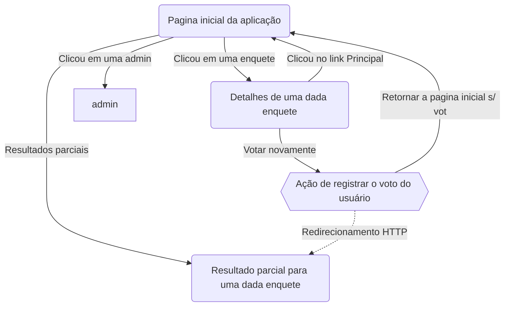

# Mapa do Site para a Aplicacão de Enquetes

Versão produzida em 25/05/2022, por Italo Gabriel 

```mermaid
flowchart TD
  index(Pagina inicial da aplicação)
  detail(Detalhes de uma dada enquete)
  vote{{Ação de registrar o voto do usuário}}
  results(Resultado parcial para uma dada enquete)
  index -- Clicou em uma enquete--> detail
  index -- Clicou em uma admin--> admin
  index -- Resultados parciais--> results
  detail -- Clicou no link Principal--> index
  detail -- Votar novamente--> vote
  vote -. Redirecionamento HTTP .-> results
  vote --Retornar a pagina inicial s/ voto--> index
```
